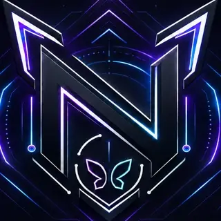
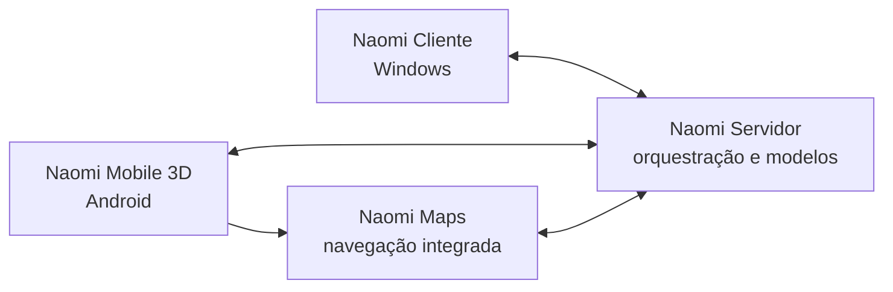

  

<h1 align="center">RyzenFox 🦊</h1>

  <strong>Criador da Naomi AI</strong> 
  Engenharia de software para conectar IA, voz, memória e experiências 3D no desktop e no celular.

  <a href="https://naomi-ia.com">Site oficial</a> ·
  <a href="https://github.com/RyzenFox/naomi-ai-public">Portfólio técnico</a> ·
  <a href="https://github.com/RyzenFox/naomi-site">Código do site</a> ·
  <a href="https://www.patreon.com/c/NaomiIA">Apoie o projeto</a>

## Meu trabalho com a Naomi

Desenvolvo a **Naomi AI**, um projeto autoral da **Kobayashi Studios** que combina assistente por voz, contexto local, presença virtual e integração entre dispositivos. Meu trabalho conecta backend, interface, áudio, Unity, serviços e distribuição em uma experiência que precisa funcionar como um sistema completo.

O projeto segue uma abordagem **local-first**: prioriza controle e persistência no dispositivo, com serviços conectados quando o recurso exige. Isso permite explicar com clareza o que acontece no PC, no celular e no servidor.

## Um ecossistema, quatro partes

| Componente | O que faz | Conheça a engenharia |
| --- | --- | --- |
| **Naomi Servidor** | Coordena contexto, modelos de IA, filas e respostas aos clientes. | [Servidor e processamento](https://github.com/RyzenFox/naomi-ai-public/blob/main/docs/servidor.md) |
| **Naomi Cliente** | Reúne interface, voz, memória e integrações no computador. | [Experiência desktop](https://github.com/RyzenFox/naomi-ai-public/blob/main/docs/cliente.md) |
| **Naomi Mobile 3D** | Leva conversa, áudio e presença 3D para o Android. | [Unity e experiência mobile](https://github.com/RyzenFox/naomi-ai-public/blob/main/docs/mobile-3d.md) |
| **Naomi Maps** | Integra localização, mapas, rotas e instruções ao Mobile 3D. | [Mapas e navegação](https://github.com/RyzenFox/naomi-ai-public/blob/main/docs/naomi-maps.md) |

Esse é um mapa conceitual. O celular tem responsabilidades e contexto próprios; o Maps faz parte da experiência mobile. Veja a [arquitetura do ecossistema](https://github.com/RyzenFox/naomi-ai-public/blob/main/docs/arquitetura.md) para entender as conexões.

## Áreas em que trabalho no projeto

- **Backend e concorrência:** Python, FastAPI, filas, cancelamento e respostas progressivas.
- **Aplicações desktop e voz:** PySide6/QML, dispositivos de áudio, reconhecimento de fala e síntese.
- **Memória e integração de IA:** contexto local, recuperação de informação, modelos e ferramentas com responsabilidades separadas.
- **Mobile e gráficos:** Unity 6, C#, URP, Android e integração de mapas em WebView.
- **Presença virtual:** comunicação entre voz, avatar, OSC, Discord, VRChat e produção de lives.
- **Web e qualidade:** Next.js, TypeScript, testes automatizados, diagnóstico e validação de pacotes.

## Explore os projetos públicos

| Projeto | Conteúdo |
| --- | --- |
| [**naomi-ai-public**](https://github.com/RyzenFox/naomi-ai-public) | Visão geral, diagramas, guias dos quatro componentes e uma demo sintética independente. |
| [**naomi-site**](https://github.com/RyzenFox/naomi-site) | Código do site oficial, com Next.js e React Three Fiber. |
| [**naomi-ia.com**](https://naomi-ia.com) | Apresentação da Naomi e acesso às experiências disponibilizadas no site. |

A Naomi está em **desenvolvimento ativo**. Os guias apresentam a base de desenvolvimento; recursos disponíveis variam por versão, dispositivo e configuração. O foco móvel documentado é Android.

A implementação completa do cliente, servidor e aplicativo mobile permanece privada. O portfólio público apresenta decisões de engenharia sem divulgar código de produção, dados pessoais, prompts completos ou configuração de infraestrutura.

<em>Construindo a Naomi como um sistema conectado, com identidade própria e responsabilidades claras.</em>

