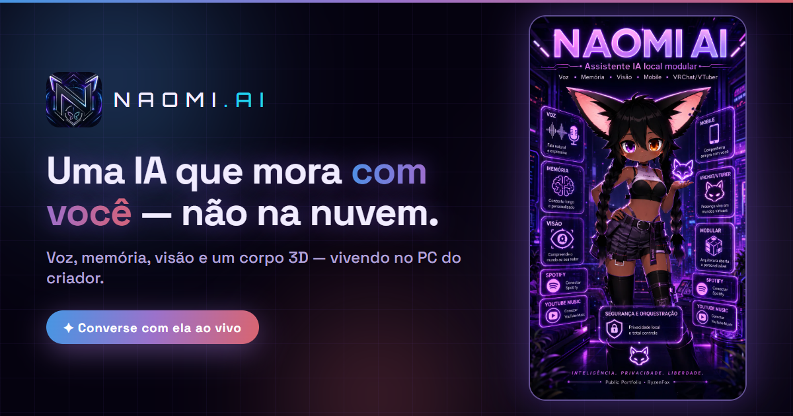

  

<h1 align="center">🦊 RyzenFox</h1>

  <strong>Criador da Naomi AI</strong> — uma assistente de IA <em>local-first</em> com voz, memória,
  visão e um corpo 3D, que mora no PC — não na nuvem.

  
  

## 🌌 O ecossistema Naomi

| Projeto | O que você encontra |
| --- | --- |
| 🌐 **[naomi-ia.com](https://naomi-ia.com)** | A demonstração ao vivo: converse com a Naomi de verdade, avatar 3D interativo, raposinha de estimação e estúdio de mídia por IA |
| 🧠 **[naomi-ai-public](https://github.com/RyzenFox/naomi-ai-public)** | A arquitetura da assistente explicada com 11 diagramas: voz, memória local, visão, lives, mobile e segurança |
| 💻 **[naomi-site](https://github.com/RyzenFox/naomi-site)** | O código do site oficial: Next.js 16 + React Three Fiber, chat que viaja por túnel até o PC onde ela vive |

> A implementação completa da Naomi (cliente desktop, servidor, mobile e instalador) é privada —
> os repositórios públicos mostram a engenharia sem expor código de produção nem segredos.

## 🛠️ Tecnologias

  
  
  
  
  
  
  
  
  
  
  

## 💜 Sobre o projeto

A Naomi nasceu como projeto autoral da **Kobayashi Studios**: uma companheira digital completa que
ouve pelo microfone, pensa com um modelo local, responde com voz e expressão, lembra das pessoas,
enxerga a tela, co-apresenta lives e ainda anda de VRChat — tudo com privacidade em primeiro lugar,
recursos de apoio emocional garantidos por código e uma arquitetura que degrada com segurança.

<em>Inteligência. Privacidade. Liberdade.</em> 🦊

